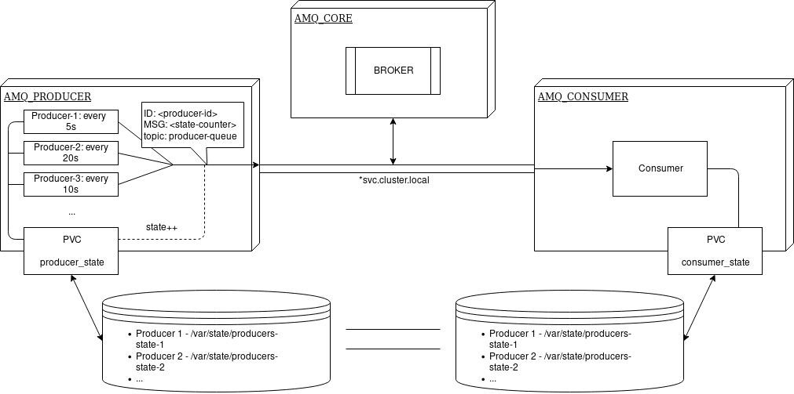

# AMQ multi-namespace application

Sample 3 namespace application, which consists from AMQ consumer, producer and broker, all located in separate namespaces. Communication is provided by internal service network.

## Overview


## Installation

Login to your OpenShift cluster

To deploy:

```bash
./build.sh
./deploy.sh
```

To remove:

```bash
./destroy.sh
```

## Usage

After successful installation, there should be 3 namespaces created.

- amq-core
- amq-consumer
- amq-producer

To check if the application is connected to service network, expect to get non empty output of the following:

```
oc project amq-consumer
oc logs <consumer-pod-name> | grep "Successfully connected to"
```

Give some time for application to establish it's state. After that check if consumer continue to report error messages:

```
oc project amq-consumer
oc logs <consumer-pod-name> | grep "Unexpected state number"
```

## Migration

After application migration, the PV state should be preserved. Check for absence of following info messages, which occur only when a new producer state is generated:

```
oc project amq-consumer
oc logs <consumer-pod-name> | grep "Stored new state file"
```
